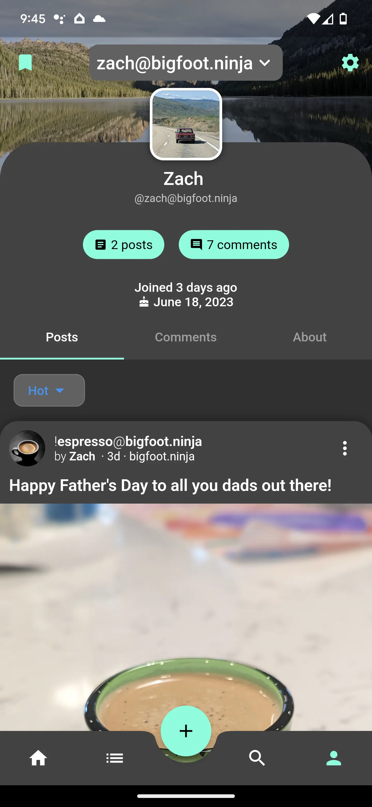
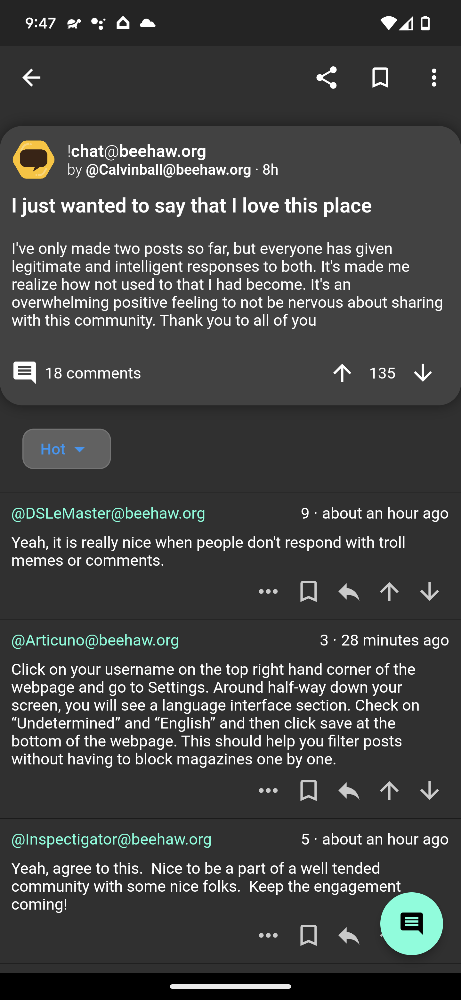

# Lemmynade

A fork of the original lemmur app we all knew and loved. It was unfortunately abandoned but this project aims to keep the legacy it started.

## How to Install
- Currently there are no binary downloads available as this is just the start of this fork. However, you can reference the old readme [here](README.md.old).

## Screenshots

## License

Copyright (C) 2020 Lemmur developers

This program is free software; you can redistribute it and/or
modify it under the terms of the GNU General Public License
as published by the Free Software Foundation; either version 2
of the License, or (at your option) any later version.

This program is distributed in the hope that it will be useful,
but WITHOUT ANY WARRANTY; without even the implied warranty of
MERCHANTABILITY or FITNESS FOR A PARTICULAR PURPOSE.  See the
GNU General Public License for more details.

You should have received a copy of the GNU General Public License
along with this program; if not, write to the Free Software
Foundation, Inc., 51 Franklin Street, Fifth Floor, Boston, MA  02110-1301, USA.